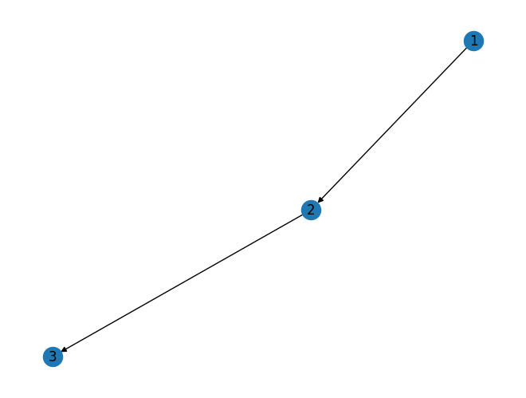

# 1、图的属性
## 1.1 如何在数学上表示一个图
通常，我们使用符号$G$来代表一个图（Graph）。

由于图是由节点（vertex / node）和边（edge / link）所组成，所以使用集合$\{V, E\}$来表示图，即$G=\{V, E\}$。其中$V=\{v_1,v_2,...,v_N\}$，是节点的集合，节点数量为$N$；$E=\{e_1,e_2,...,e_M\}$是边的集合，边的数量为$M$。连接两个节点$v_1$和$v_2$的边可以表示为$e=(v_1,v_2)$。

如图所示，是一个节点数$N=5$，边数$M=6$的图。其可以表示为：$G=\{V,E\}, \quad V=\{v_1,v_2,v_3,v_4,v_5\},\quad E=\{e_1,e_2,e_3,e_4,e_5,e_6\}$。

<center>
     
    <br>
    <div>图1-1. 无向图</div>
</center>

在图中，节点和边是可以包含信息的。常见的信息包括两种，分别是**类别型**和**数值型**。类别型的数据的取值只能是哪一类别，一般称类别型的信息为标签（label）；数值型数据的取值范围为实数。一般称数值型的信息为属性（attribute）。一般认为**节点一定含有信息（至少含有节点的度的信息），边可能含有信息**。

## 1.2 图的分类
根据不同的划分规则，图可以被划分为多种类型。常见的划分方式有以下几种。

### 1.2.1 有向图和无向图
根据图中的边是否具有指向性，可以分为有向图和无向图。图1-1就是无向图，而图1-2是有向图。
<center>
     
    <br>
    <div>图1-2. 有向图</div>
</center>

### 1.2.2 有权图和无权图
根据图的边上权重是否为 $1$，我们可以将它们分为：
- 图的边上的权重为 $1$ 时，它是一个无权图（unweighted graph）。
- 图的边上的权重不为 $1$ 的时候，它是一个有权图（weighted graph）。我们记点 $v_i$ 到 $v_j$ 的权重为 $w_{ij}$.

<center>
     
    <br>
    <div>图1-3. 无权图（左）和有权图（右）</div>
</center>

### 1.2.3 同质图和异质图
- 同质图（Homogeneous Graph）：只有一种类型的节点和一种类型的边的图。
- 异质图（Heterogeneous Graph）：存在多种类型的节点和多种类型的边的图。

### 1.2.4 其他分类方法
除了上述广为人知的分类方法，还可以根据拓扑结构对图进行分类，还有二分图等。因为暂时用不到，这里就不介绍了。

## 1.3 图的性质
### 1.3.1 相邻节点
图的相邻节点包含两类：直接相连的相邻节点和$k$跳远的相邻节点。
- 节点 $v_i$ 的相邻节点（neighbors）是与节点 $v_i$ 直接相连的节点，其被记为 ${N(v_i)}$。
- 节点 $v_i$的 $k$ 跳远的相邻节点（neighbors with $k$-hop）是到节点 $v_i$ 要走 $k$ 步的节点。又称为k-hop。一个节点1-hop的相邻节点是与这个节点直接相连的全部节点$^{[1]}$，k-hop算法采用的是宽度优先搜索（BFS）的方式。。

例如，在图1-1中，节点$v_1$的相邻节点$N(v_1)=\{v_2,v_3,v_5\}$。节点$v_1$的2跳远的节点为：$\{v_4\}$。计算过程为：

1. 从节点$v_1$出发，首先访问所有1-hop邻居，即直接与$v_1$相连的节点，这里是节点$v_2$、节点$v_3$和节点$v_5$。
2. 对于节点$v_2$的邻居，我们访问节点$v_3$（但节点$v_3$已经是$v_1$的1-hop邻居，所以不计入2-hop邻居）。
3. 对于节点$V_3$的邻居，我们访问节点$v_4$（$v_1-v_3-v_4$是两跳）和节点$v_5$（但节点$v_5$已经是$v_1$的1-hop邻居，所以不计入2-hop邻居）。
4. 对于节点$v_5$的邻居，我们访问节点$v_3$（但节点$v_3$已经是$v_1$的1-hop邻居，所以不计入2-hop邻居）。

### 1.3.2 节点的度
节点 $v_i$ 的度记为 $d(v_i)$，入度记为 $d_{in}(v_i)$，出度记为 $d_{out}(v_i)$。
- 对于**有向有权图**：节点 $v_i$ 的出度（out degree）等于从 $v_i$ 出发的边的权重之和；节点 $v_i$ 的入度（in degree）等于从连向 $v_i$ 的边的权重之和。
- **有向无权图**是有权图的特殊情况，各边的权重为 $1$，那么节点 $v_i$ 的出度（out degree）等于从 $v_i$ 出发的边的数量，节点 $v_i$ 的入度（in degree）等于从连向 $v_i$ 的边的数量。
- **无向有权图**和**无向无权图**是有向图的特殊情况，节点的出度与入度相等。

### 1.3.3 平均度和度分布
**平均度**是一个表达网络整体性质重要的参数，等于所有节点度的平均值。对于无向无权图来说，其节点数量为$N$，边的数量为$M$。由于其出度=入度，所以平均度的计算公式为：
$$
 \bar{d}({G})=\frac{1}{N}\sum^{N}_{i=1}d_i=\frac{2M}{N} 
$$

**度分布 $P(d)$** 表示随机选择的节点的度为 $d$ 的概率，平均度即度的期望：
$$
\bar{d}({G})=\sum_{d=0}^{\infty} dP(d)
$$

### 1.3.4 walk和path
图$G$的一条通路(walk)是指一条由顶点与边组成的交错序列$^{[2]}$:
$$v_1,e_1,e_2,v_2,e_3,...$$
里面的顶点和边都可以重复。
例如，下图中，$walk(v_1,v_2)=(v_1,e_5,e_4,e_6,v_1,e_1,v_2)$，这是一次walk，红色线条标识了边的访问顺序。这里要注意，并不是意味着从$v_1$到$v_2$一定要这样走，这只是一个walk。

**而一个path中，节点是不可重复的**。即path是节点不可重复的walk。

<center>
     
    <br>
    <div>图1-4. walk示意图</div>
</center>

### 1.3.5 距离（distance）和直径（diameter）
最短路径（shortest path）被定义为两个点之间的距离（distance）。

**最短路径** $v_{s}, v_{t} \in {V}$ 是图 ${G}=\{{V}, {E}\}$ 上的一对节点，节点对 $v_{s}, v_{t} \in {V}$ 之间所有路径的集合记为 $p_{st}$。节点对 $v_{s}, v_{t}$ 之间的最短路径 $p_{st}^{sp}$ 为 $p_{st}$ 中长度最短的一条路径，其形式化定义为
$$p_{st}^{sp}= argmin_{p \in P_{st}}|p|$$
其中， $p$表示  $p_{st}$ 中的一条路径，$|p|$是路径$p$的长度。
- **直径（diameter）**：给定一个连通图 ${G}=\{{V}, {E}\}$，其直径为其所有节点对之间的**最短路径的最大值**，形式化定义为

$$
diameter({G})=max_{v_{s}, v_{t} \in {V}} min_{p \in p_{s t}}|p|
$$

### 1.3.6 子图（subgraph）、连通分量（connected component）、连通图（connected graph）
- **子图（subgraph）**：有一图 ${G}=\{{V}, {E}\}$ ，另有一图 ${G}^{\prime}=\{{V}^{\prime}, {E}^{\prime}\}$ ，其中 ${V}^{\prime} \in {V}$ ， ${E}^{\prime} \in {E}$ 并且 ${V}^{\prime}$ 不包含 ${E}^{\prime}$ 中未出现过的节点，那么 ${G}^{\prime}$ 是 ${G}$ 的子图。
- **连通分量（connected component）**：给定图 ${G}^{\prime}=\{{V}^{\prime}, {E}^{\prime}\}$ 是图 ${G}=\{{V}, {E}\}$ 的子图。记属于图 ${G}$ 但不属于 ${G}^{\prime}$ 图的节点集合记为 ${V} \setminus {V}^{\prime}$ 。如果属于 ${V}^{\prime}$ 的任意节点对之间存在至少一条路径，但不存在一条边连接属于 ${V}^{\prime}$ 的节点与属于 ${V} \setminus {V}^{\prime}$ 的节点，那么图 ${G}^{\prime}$ 是图 ${G}$ 的连通分量。
- **连通图（connected graph）**：当一个图只包含一个连通分量，即其自身，那么该图是一个连通图。

### 1.3.7 聚类系数和接近中心度
emmm，暂时我也没用到过这两个概念，所以就写一下定义。如果后续用到了再好好学一下。
- 聚类系数表示给定节点的**邻居彼此链接的程度**。
- 节点 $i$ 的邻域互连越紧密，其局部聚类系数越高。
- $C_i$ 是节点的两个邻居相互链接的概率。
- 对于度数为 $d_i$ 的节点 i，**局部聚类系数**定义为 
$$C_i=\frac{E_i}{T_i}$$

其中，$E_i$ 表示节点 $i$ 的邻居实际存在的边的数量，$T_i$ 表示节点 $i$ 的邻居可能（最多）存在的边的数量。
- $C_i = 0$ 如果节点 i 的邻居都没有相互链接。
- $C_i = 1$ 如果节点 i 的邻居形成一个全连接图，即它们都相互链接。
- $C_i = 0.5$ 意味着一个节点的两个邻居有 $50\%$ 的机会链接。
- **网络的聚类系数**即**平均聚类系数**：是所有节点的集聚系数的平均值为
$$C=\frac{1}{N}\sum_i C_i$$

- 在连通图中，节点的**接近中心性**（或接近性）是网络中中心性的度量，计算为该节点与图中所有其他节点之间的最短路径长度之和的倒数。
- 节点越中心，它与所有其他节点越接近。
- 接近中心度的计算公式为
$$c(v) = \frac{1}{\sum_{u \neq v}\text{shortest path length between } u \text{ and } v}$$

## 1.4 图的连接表示
这里介绍三种图的连接表示：邻接矩阵、关联矩阵和拉普拉斯矩阵。
### 1.4.1 邻接矩阵（Adjacency Matrix）
- 给定一个无权图 ${G}=\{{V}, {E}\}$，其对应的邻接矩阵被记为 $\mathbf{A} \in\{0,1\}^{N \times N}$，$\mathbf{A_{i,j}}=1$ 表示存在从节点 $v_i$ 到 $v_j$ 的边，$\mathbf{A}_{i, j}=0$ 表示不存在从节点 $v_i$ 到 $v_j$ 的边。
- 在无向图中，从节点 $v_i$ 到 $v_j$ 的边存在，意味着从节点 $v_j$ 到 $v_i$ 的边也存在。因而**无向图的邻接矩阵是对称的**。
- 在无权图中，**各条边的权重被认为是等价的**，即认为**各条边的权重为1**。
- 对于**有权图**，其对应的邻接矩阵通常被记为 $\mathbf{W} \in \mathbb{R}^{N \times N}$，其中 $\mathbf{W_{i, j}}=w_{ij}$ 表示从节 $v_i$ 到 $v_j$ 的边的权重。若边不存在时，边的权重为 $0$ 。
<center>
     
    <br>
    <div>图1-5. 无向无权图的邻接矩阵</div>
</center>

<center>
     
    <br>
    <div>图1-6. 有向有权图的邻接矩阵</div>
</center>

### 1.4.2 关联矩阵（Incidence Matrix）
与邻接矩阵不同，关联矩阵描述的是定点和边之间的关系。
- 给定一个图 ${G}=\{{V}, {E}\}$，其对应的**关联矩阵**被记为 $\mathbf{M} \in\{-1,0,1\}^{N \times M}$。（这里用加粗的 $\mathbf{M}$ 表示关联矩阵，用不加粗的 $M$ 表示边的个数）
- 对于无向图来说，$\mathbf{M_{i, j}}=1$ 表示节点 $v_i$ 和边 $e_j$ 相连接（即顶点在边上），$\mathbf{M_{i, j}}=0$ 表示节点 $v_i$ 和边 $e_j$ 不相连接。无向图里$\mathbf{M_{i,j}}$是不会为-1的。
- 对于有向图，其$\mathbf{M_{i, j}}$的取值为$^{[3,4]}$：

$$ 
\mathbf{M_{i, j}}=\left\{
\begin{aligned}
1 &, & v_i是e_i的起点 \\
0 &, & v_i与e_i不关联 \\
-1 &, & v_i是e_i的终点
\end{aligned}
\right.
$$

<center>
     
    <br>
    <div>图1-7. 无向图的关联矩阵</div>
</center>

<center>
     
    <br>
    <div>图1-8. 有向图的关联矩阵</div>
</center>

### 1.4.3 拉普拉斯矩阵（Laplacian Matrix）
在这里只是提一下，后面会再写一篇文章详细推导一下拉普拉斯矩阵。

**拉普拉斯矩阵（Laplacian Matrix / admittance matrix, Kirchhoff matrix）**：给定一个图 ${G}=\{{V}, {E}\}$，其邻接矩阵为 $A$，其拉普拉斯矩阵 $L$ 定义为
$$\mathbf{L=D-A}$$
其中$\mathbf{D=diag(d(v_1), \cdots, d(v_N))}$是度矩阵。更具体地，我们记拉普拉斯矩阵中每一个元素为 $L_{ij}$，那么每一个元素可以被定义为：
$$ 
L_{i,j}=
\begin{cases}
d_i & , & \text{if  i = j} \\
-1 &, & \text{if i} \neq \text{j and $v_i$  adjacent with j} \\
0 &, & \text{otherwise}
\end{cases}
$$

它的每一行和列的加和为$0$。
  
  **对称归一化的拉普拉斯矩阵，Symmetric normalized Laplacian）**：给定一个图${G}=\{{V}, {E}\}$，其邻接矩阵为$A$，其规范化（归一化）的拉普拉斯矩阵定义为

$$
\mathbf{L=D^{-\frac{1}{2}}(D-A)D^{-\frac{1}{2}}=I-D^{-\frac{1}{2}}AD^{-\frac{1}{2}}}
$$

# 2、networkx的使用
## 2.1 创建无向图
```python
import networkx as nx
import matplotlib.pyplot as plt
import numpy as np

g = nx.Graph()
# 添加图的节点
g.add_node(1)
g.add_node(2)
g.add_node(3)
g.add_node(5)
# 添加图的边
g.add_edge(1, 2)
g.add_edge(2, 3) 
g.add_edge(3, 4) # 当添加的边对应的节点不存在的时候，会自动创建相应的节点
g.add_edge(3, 5)
g.add_edge(5, 1)
g.add_edge(1, 3)

# 绘制的图带label
nx.draw(g, with_labels=True)
```
这里绘制出一个和图1-1一样结构的图出来：


## 2.2 创建有向图
```python
# 判断图是否为有向图
dg = nx.DiGraph()
print(g.is_directed())
print(dg.is_directed())
```
输出为：
```
False
True
```
```python
# 添加图的节点
dg.add_node(1)
dg.add_node(2)
# 添加图的边
dg.add_edge(1, 2)
dg.add_edge(2, 3) # 当添加的边对应的节点不存在的时候，会自动创建相应的节点
# 绘制有向图
nx.draw(dg, with_labels=True)
```


## 2.3 空手道俱乐部
空手道俱乐部是一个比较有名的数据集：
```python
KG = nx.karate_club_graph() # 创建空手道俱乐部图
nx.draw(KG, with_labels=True)
```


## 2.4 图的性质
### 2.4.1 计算指定节点的邻接节点
```python
neigbor = [n for n in g.neighbors(1)]
print(neigbor)

# 计算k-hop邻接节点
def get_neigbors(g, node, depth=1):
    output = {}
    layers = dict(nx.bfs_successors(g, source=node, depth_limit=depth))
    nodes = [node]
    for i in range(1,depth+1):
        output[i] = []
        for x in nodes:
            output[i].extend(layers.get(x,[]))
        nodes = output[i]
    return output[depth]

k_hop_neigbor = get_neigbors(g, 1, 2)
print("k-hop neigbors: ", k_hop_neigbor)
```
输出为：
```
[2, 5, 3]
k-hop neigbors:  [4]
```

### 2.4.2 计算节点的度
```python
print(g.degree(1)) # 节点1的度
print(g.degree()) # 所有节点的度
```
输出：
```
3
[(1, 3), (2, 2), (3, 4), (5, 2), (4, 1)]
```

### 2.4.3 计算平均度和度分布
```python
# 计算平均度
def average_degree(num_edges, num_nodes):
    # this function takes number of edges and number of nodes
    # returns the average node degree of the graph. 
    # Round the result to nearest integer (for example, 3.3 will be rounded to 3 and 3.7 will be rounded to 4)
    avg_degree = 0
    #########################################
    avg_degree = 2*num_edges/num_nodes
    avg_degree = int(round(avg_degree))
    #########################################
    return avg_degree

num_edges = g.number_of_edges()
num_nodes = g.number_of_nodes()
avg_degree = average_degree(num_edges, num_nodes)
print("Average degree of the given graph is {}".format(avg_degree))


print(nx.degree_histogram(g)) # 度分布
```
输出：
```
Average degree of karate club network is 2
[0, 1, 2, 1, 1]
```

### 2.4.4 聚类系数
```python
def average_clustering_coefficient(G):
    # this function that takes a nx.Graph
    # and returns the average clustering coefficient. 
    # Round the result to 2 decimal places (for example 3.333 will be rounded to 3.33 and 3.7571 will be rounded to 3.76)
    avg_cluster_coef = 0
    #########################################
    ## Note: 
    ## 1: Please use the appropriate NetworkX clustering function
    avg_cluster_coef = nx.average_clustering(G)
    avg_cluster_coef = round(avg_cluster_coef, 2)
    #########################################
    return avg_cluster_coef

avg_cluster_coef = average_clustering_coefficient(g)
print("Average clustering coefficient of the given graph is {}".format(avg_cluster_coef))
```
输出：
```
Average clustering coefficient of the given graph is 0.6
```

### 2.4.5 接近中心度
```python
def closeness_centrality(G, node=5):
    # the function that calculates closeness centrality 
    # for a node in karate club network. G is the input karate club 
    # network and node is the node id in the graph. Please round the 
    # closeness centrality result to 2 decimal places.

    closeness = 0
    #########################################
    # Raw version following above equation
    # source: https://stackoverflow.com/questions/31764515/find-all-nodes-connected-to-n
    path_length_total = 0 
    for path in list(nx.single_source_shortest_path(G,node).values())[1:]:
        path_length_total += len(path)-1

    closeness = 1 / path_length_total
    closeness = round(closeness, 2)

    return closeness

node = 5
closeness = closeness_centrality(g, node=node)
print("The given graph has closeness centrality (raw) {:.2f}".format(closeness))

# Normalized version from NetworkX
# Notice that networkx closeness centrality returns the normalized 
# closeness directly, which is different from the raw (unnormalized) 
# one that we learned in the lecture.
closeness = nx.closeness_centrality(g, node)
print("The given graph has closeness centrality (normalzied) {:.2f}".format(closeness))
```
输出为：
```
The given graph has closeness centrality (raw) 0.17
The given graph has closeness centrality (normalzied) 0.67
```

## 2.5 图的连接
### 2.5.1 计算邻接矩阵
```python
A = np.array(nx.adjacency_matrix(g, nodelist=[1, 2, 3, 4, 5]).todense())
print(A)
```
输出：
```
[[0 1 1 0 1]
 [1 0 1 0 0]
 [1 1 0 1 1]
 [0 0 1 0 0]
 [1 0 1 0 0]]
```
这里要加nodelist，因为默认的nodelist顺序不是12345这样排列，就会得到和我们自己计算不一致的结果$^{[5]}$。默认的节点顺序为：
```python
g.nodes()
```
输出：
```
NodeView((1, 2, 3, 5, 4))
```

### 2.5.2 计算关联矩阵
```python
B = np.array(nx.incidence_matrix(g, nodelist=[1, 2, 3, 4, 5], edgelist=[(1, 2), (2, 3), (3, 4), (3, 5), (5, 1), (1, 3)]).todense())
print(B)
```
输出：
```
[[1. 0. 0. 0. 1. 1.]
 [1. 1. 0. 0. 0. 0.]
 [0. 1. 1. 1. 0. 1.]
 [0. 0. 1. 0. 0. 0.]
 [0. 0. 0. 1. 1. 0.]]
```
这里要加nodelist和edgelist，因为默认的顺序不是按顺序排列，就会得到和我们自己计算不一致的结果$^{[6]}$。默认的边顺序为：
```python
g.edges()
```
输出：
```python
EdgeView([(1, 2), (1, 5), (1, 3), (2, 3), (3, 4), (3, 5)])
```

参考资料：

[1] https://arxiv.org/abs/1907.06051 

[2] http://www.atzjg.net/admin/do/view_question.php?qid=2106

[3] https://blog.csdn.net/luzaijiaoxia0618/article/details/104720948

[4] http://123.56.88.210/ppt/lisan_10.pdf

[5] https://www.osgeo.cn/networkx/reference/generated/networkx.linalg.graphmatrix.adjacency_matrix.html#google_vignette

[6] https://networkx.org/documentation/stable/reference/generated/networkx.linalg.graphmatrix.incidence_matrix.html
